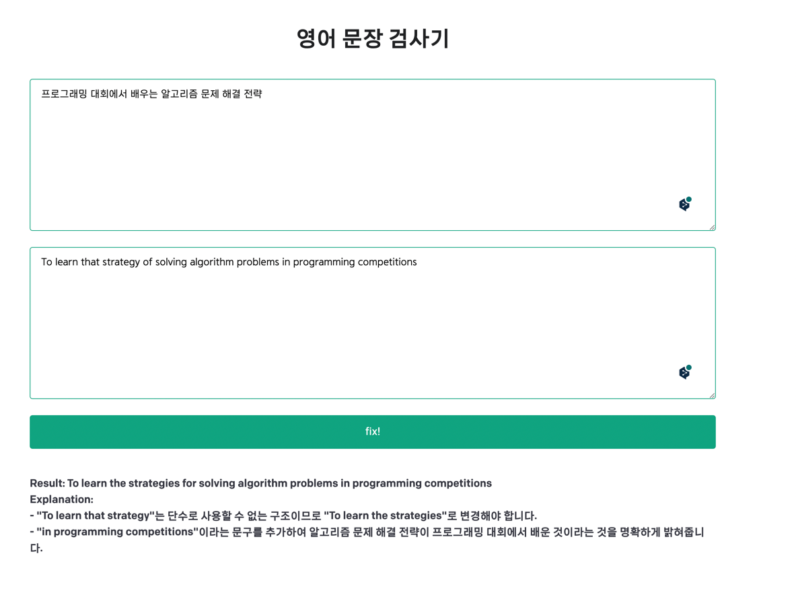

# 요약

영어 학습을 위해 만들어진 OpenAI 를 이용한 간단한 프로그램입니다.
좋은 기능이 있다면 컨트리 뷰팅이 가능합니다.



## 설정

1. NodeJS 가 깔려있지 않으시다면 14 버전 이상의 NodeJS 를 설치해주세요.

2. 해당 Repository 를 복제(Clone) 합니다.

3. npm install 을 진행해줍니다.

   ```bash
   $ npm install
   ```

4. .env.example 파일을 .env 로 복사해줍니다.

   On Linux systems: 
   ```bash
   $ cp .env.example .env
   ```
   On Windows:
   ```powershell
   $ copy .env.example .env
   ```
   
5. 발급받으신 [API key](https://beta.openai.com/account/api-keys) 를 `.env` file 에 추가해줍니다.

6. 앱을 시작합니다.

   ```bash
   $ npm run dev
   ```